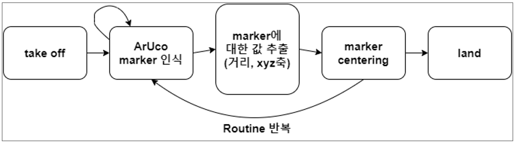
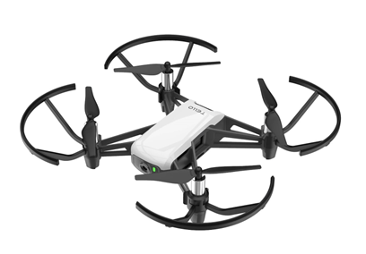
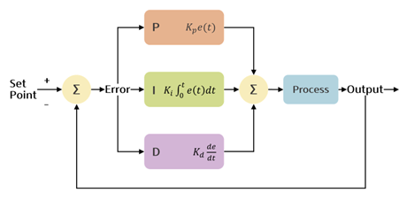

# 🛰️ 실내 스마트팜을 위한 자율 드론 관리 시스템

<br>

## 🧩 Executive Summary

본 프로젝트는 **실내 스마트팜 환경에서 자율 드론을 활용한 새로운 관리 방식**을 제안합니다.  
기존 스마트팜은 고도의 자동화를 지향하지만, **실내 환경에서는 GPS 미지원, 구조 복잡성, 인력 부족 등의 제약**이 존재합니다.  
이를 해결하기 위해 다음 기획을 적용한 자율 비행 드론 시스템을 개발하였습니다.

<br><br>

## 🎯 Project Goal

- 실내 스마트팜 내 드론의 **정확한 위치 측위 및 제어 시스템** 구축
- 작물의 **성장 상태, 병충해, 온도, 습도** 등을 실시간 모니터링
- **자동 처리를 통한 운영 자동화 및 효율성 제고**

<br><br>

## 👥 Key Project Stakeholders

- 실내 스마트팜의 운영 효율을 높이고자 하는 **스마트팜 관리자**
- 사람의 개입을 줄이고 드론을 통해 **지속적 자동 관리를 지향하는 사용자**

<br><br>

## 🚀 제안한 솔루션
- **AR(Augmented Reality) 마커 기반 위치 인식**
  - 마커는 스마트팜 각 행의 시작/끝에 배치
  - 드론은 카메라로 마커를 인식하여 실시간 위치 계산
- **Marker Centering 알고리즘 개발**
  - 드론으로부터 AR 마커까지의 거리, 인식된 AR 마커의 크기와 xyz축 값 추출
  - 드론이 AR마커를 정면으로 보도록 좌우, 상하, 전후, yaw축을 조정하며 Centering 구현
- **PD(Proportional-Derivative) 제어**
  - 드론이 x, y, z축 방향으로 정밀하게 마커 중심으로 이동
  - 오버슈팅 최소화
- **확장 칼만필터(EKF) 적용**
  - 마커가 감지되지 않을 때 센서 기반 예측으로 위치 추정
  - 안정적인 궤적 유지 가능
- **마커 탐색 루틴**
  - 일정 시간 마커 미탐지 시 자동 회전하여 재탐색

<br><br>

## 📊 시스템 동작 흐름



1. **Take off**: 드론 이륙
2. **ArUco Marker 인식**: 카메라로 마커 탐색
3. **Marker 값 추출**: 거리 및 좌표(x, y, z) 계산
4. **Marker Centering**: PD 제어를 통한 위치 정렬
5. **Land**: 착륙 (필요 작업 완료 후)

※ 인식 실패 시 회전하며 마커 탐색 루틴 반복

<br><br>

## 🧠 Proposed Design and Solution

### 🏗️ 3.1 Overall System Architecture

시스템은 크게 세 가지 블록으로 구성됩니다:

1. **드론 하드웨어 (DJI Tello)**
2. **제어 프로그램 블록 (자동 및 수동 제어 알고리즘 포함)**
3. **사용자 인터페이스 (PyQt 기반 실시간 UI)**


<br><br>

### 🔧 시스템 구성 요소

#### 1️⃣ 드론 하드웨어
- **DJI Tello EDU** 드론 사용
- 실내 스마트팜의 좁은 통로(약 20~30cm)에서도 운용 가능
- 내장 카메라 (5MP, 720p HD)로 실시간 스트리밍
- **ArUco 마커** 인식 기능 내장
- **호버링(Vision Position System)** 및 **모터 속도 제어** 가능 <br>
  

#### 2️⃣ 사용자 인터페이스 (UI)
- **PyQt5 기반 UI**
- 수동/자동 제어 모드 전환 가능
- 드론의 배터리 상태, IMU 센서, 통신 상태 실시간 표시
- 스마트팜 환경 정보(온도, 습도, 조도 등) 실시간 제공

#### 3️⃣ 제어 프로그램 블록
- **자동 모드**
  - ArUco 마커를 인식하여 거리/각도 계산
  - 마커 중심으로 위치 정렬 후 다음 마커로 이동
  - **PID 제어기**로 정밀 이동 제어 (비례 + 미분 제어 적용)
  - 마커를 인식하지 못할 경우 회전 탐색 루틴 수행

- **수동 모드**
  - 키보드 입력 또는 UI 버튼으로 명령 전송
  - 실시간 영상 피드백 기반 수동 관찰 가능

<br><br>

### 🧠 제어 알고리즘 요약

- **카메라 캘리브레이션**
  - 체커보드 기반 보정 수행 (K, R, t 행렬 도출)
  - 이미지 왜곡 제거 및 정확한 위치 추정 확보

- **PID 제어**
  - 목표 마커 중심을 기준으로 x, y, z, yaw 제어
  - 제어식:
    ```
    output = Kp * e(t) + Ki * ∫e(t)dt + Kd * de(t)/dt
    ```
    
  
- **Odometry 기반 보조 위치 추정**
  - IMU 및 이동 속도 기반 위치 추정
  - 마커 인식이 실패할 경우 보조적으로 활용 <br>
  <!--
     <br>
    
  -->
  
<br><br>

### 💡 최적화 사항

- **성능 문제**: PyQt의 `QThread` 사용으로 병목 해소
- **안정성 문제**: 마커 인식 성능 향상을 위해 조명 환경 개선 및 Adaptive Thresholding 적용
- **UI 문제**: 직관적인 PyQt5 기반 레이아웃 구성 및 그룹화
- **확장성 고려**: 공장, 물류센터 등 다양한 환경에 적용 가능

<br><br>

### 📦 주요 모듈 구성 (클래스 기준)

| 시스템            | 주요 클래스/기능 설명 |
|------------------|---------------------|
| Main System      | UI 중앙 제어, 상태 정보 제공 |
| Command System   | 키보드/버튼 입력 → 드론 명령 생성 |
| Routing System   | ArUco 마커 기반 루틴 수행 자동 제어 |
| ArUco Marker     | 마커 인식, 자세 추정 및 거리 계산 |
| Odometry System  | 센서 기반 위치 추정 및 Plot 시각화 |

<br><br>

### 🎮 자동 루틴 수행 흐름

1. 드론 이륙 (Takeoff)
2. ArUco 마커 인식
3. 거리/각도 계산
4. PID 제어로 중심 정렬
5. 다음 마커로 이동
6. 마커 미탐지 시 회전 탐색
7. 루틴 종료 후 착륙 (Landing)


<br><br>

## ✅ Implementation Result

프로젝트에서 설계한 드론 시스템의 **정의된 루틴**이 실제로 잘 작동하는지를 중심으로 테스트를 수행했습니다.

### 🎯 루틴 수행 결과

- 드론은 **목표 마커를 인식한 후**, 마커의 중심으로 정렬된 뒤 **다음 마커로 이동**하는 루틴을 정확히 수행함
- 각 층에 부착된 마커를 **정확하게 따라가며 비행**
- **실제 루틴 비행 경로는 4.1.3 구현 결과의 그래프**로 확인 가능

### ⏱ 수행 성능 측정

| 항목 | 수치 |
|------|------|
| **루틴 1회 소요 시간** | 약 2분 ~ 2분 30초 |
| **배터리 소모량** | 약 20% ~ 25% |
| **비행 정밀도** | 좁은 공간 내에서도 **8cm 이내**의 정확도로 비행 수행 |

### 🛠 시스템 평가

- 프로그램에서 정의된 **자동 루틴 알고리즘**이 실내 환경에서도 안정적으로 동작함
- 드론은 구조물에 충돌하지 않고 루틴을 마침
- 제한된 공간에서도 마커 중심 정렬 및 연속 비행이 가능함

### 🔍 의의 및 기대효과

- **실내 스마트팜의 자동화를 위한 드론 시스템의 실효성 검증**
- 드론 기반 자율 관리를 통해 **운영 효율 및 생산성 향상**
- **인력 부족 및 비용 문제 해결**에 기여할 수 있는 실질적인 솔루션 제시

<br><br>

## 📌 결론

이 시스템은 실내 스마트팜 운영에 있어 드론의 실용성을 극대화하고,  
**지속적인 감시와 작업 자동화를 통해 농업의 미래 방향성을 제시**합니다.

<br><br>

## 🛠️ 사용 기술

- **OpenCV**: 영상 처리 및 ArUco 마커 인식
- **Kalman Filter**: 실내 위치 추정
- **PD Controller**: 안정적 위치 제어
- **Python, Drone SDK** 등

<br><br>

<br />  

## 👥 Collaborators  

| **김석완** | **김형진** | **서예경** | **정지민** |
|:----------:|:----------:|:----------:|:----------:|
|  |  |  |  |
| [@Kim-Seokwan](https://github.com/wanilly) | [@Kim-Hyeongjin](https://github.com/hhjj0506) | [@Seo-Yegyeong](https://github.com/Seo-Yegyeong) | [@Jeong-Jimin](https://github.com/21900679) |

<br />  
